# API Integration Summary - Weekly Football Squares

This document summarizes the comprehensive API integration implemented to replace mock data with real, production-ready API services.

## 🎯 Overview

The project has been transformed from using mock/hard-coded data to a robust API-driven architecture with real-time updates, proper error handling, and production-ready features including the 95% threshold logic for board cancellation.

## 📁 Files Created/Modified

### New API Service Layer

- `/lib/api/types.ts` - Comprehensive TypeScript interfaces for all API operations
- `/lib/api/boardService.ts` - Board management with real-time availability tracking
- `/lib/api/gameService.ts` - NFL schedule integration with multiple API fallbacks
- `/lib/api/websocketService.ts` - Real-time updates for board changes and game scores

### New React Hooks

- `/hooks/useBoardData.ts` - Board data management with real-time updates
- `/hooks/useGameData.ts` - NFL game schedule and scoring data management

### Updated Components

- `/components/BoardSelector.tsx` - Completely refactored to use real API data
- `/components/ErrorBoundary.tsx` - Comprehensive error handling and loading states

## 🔄 Key Transformations

### 1. Mock Data Replacement

**Before:**

```typescript
// Mock data generation
const generateMockGames = (userTeam: NFLTeam): GameSchedule[] => {
  // Hard-coded game generation
  const games: GameSchedule[] = [];
  for (let i = 0; i < 4; i++) {
    games.push({
      gameId: `game-${userTeam.id}-${currentWeek + i}`,
      // ... more mock data
    });
  }
  return games;
};

// Mock board availability
const getBoardAvailability = (tier: BoardTier, game: GameSchedule) => {
  const soldSquares = Math.floor(Math.random() * 85) + 5;
  return {
    totalSquaresSold: soldSquares,
    availableSquares: 100 - soldSquares,
    isActive: soldSquares < 100,
  };
};
```

**After:**

```typescript
// Real API integration with hooks
const {
  games: availableGames,
  loading: gamesLoading,
  error: gamesError,
  refreshGames,
  isConnected,
} = useTeamGames(userTeam, { upcomingOnly: true });

const {
  boards: gameBoards,
  loading: boardsLoading,
  error: boardsError,
  refetch: refreshBoards,
} = useGameBoards(selectedGame?.gameId);
```

### 2. Board State Management

**Before:**

```typescript
// Simple mock state
const isActive = soldSquares < 100;
```

**After:**

```typescript
// Comprehensive board state with cancellation logic
export enum BoardState {
  OPEN = 'open',
  FILLING = 'filling',
  THRESHOLD_WARNING = 'threshold_warning',
  LOCKED = 'locked',
  CANCELLED = 'cancelled',
  LIVE = 'live',
  COMPLETED = 'completed',
}

// 95% threshold logic
const isNearCancellation = BoardUtils.isNearCancellationThreshold(availability);
const canPurchase = BoardUtils.canPurchaseSquares(availability);
```

### 3. Real-time Updates

**Before:**

```typescript
// Static data with manual refresh
useEffect(() => {
  const games = generateMockGames(userTeam);
  setAvailableGames(games);
}, [userTeam]);
```

**After:**

```typescript
// WebSocket integration for live updates
useEffect(() => {
  websocketService.subscribeToBoard(boardId, handleBoardUpdate);
  return () => {
    websocketService.unsubscribeFromBoard(boardId, handleBoardUpdate);
  };
}, [boardId, handleBoardUpdate]);
```

## 🚀 New Features Implemented

### 1. 95% Threshold Logic

- **Automatic Cancellation**: Boards that don't reach 95% capacity by deadline are automatically cancelled
- **Warning System**: Visual indicators when boards approach cancellation risk
- **Real-time Monitoring**: Live tracking of fill percentage with WebSocket updates

```typescript
// Cancellation threshold warning
{isNearCancellation && availability.boardState !== BoardState.CANCELLED && (
  <div className="mt-2 p-2 bg-orange-100 dark:bg-orange-900 rounded text-xs">
    <div className="flex items-center gap-1 text-orange-700 dark:text-orange-300">
      <AlertTriangle className="w-3 h-3" />
      <span className="font-medium">Cancellation Risk</span>
    </div>
    <p className="text-orange-600 dark:text-orange-400 mt-1">
      Board needs {availability.cancellationThreshold}% filled to avoid cancellation.
      Currently at {fillPercentage.toFixed(1)}%.
    </p>
  </div>
)}
```

### 2. Real-time Board Updates

- **Live Square Purchases**: Instant updates when other users purchase squares
- **Board State Changes**: Real-time notifications for locks, cancellations, VRF completion
- **Game Score Updates**: Live scoring updates during games

### 3. Comprehensive Error Handling

- **Network Resilience**: Multiple API endpoints with fallback support
- **Retry Logic**: Intelligent retry mechanisms with exponential backoff
- **User-friendly Messages**: Clear error states with actionable recovery options

### 4. Loading States & UX

- **Skeleton Loading**: Proper loading indicators for all async operations
- **Progressive Enhancement**: Graceful degradation when features are unavailable
- **Accessibility**: Screen reader friendly with proper ARIA labels

## 🔧 API Service Architecture

### Board Service (`boardService.ts`)

```typescript
class BoardService {
  // Get real-time board availability
  async getBoardAvailability(gameId: string, tierId: string): Promise<ApiResponse<BoardAvailabilityResponse>>

  // Purchase squares with validation
  async purchaseSquares(request: PurchaseSquareRequest): Promise<ApiResponse<PurchaseSquareResponse>>

  // Validate selection before purchase
  async validateSquareSelection(boardId: string, squareIndices: number[], walletAddress: string)

  // 95% threshold utilities
  BoardUtils.isNearCancellationThreshold(boardAvailability)
  BoardUtils.canPurchaseSquares(boardAvailability)
}
```

### Game Service (`gameService.ts`)

```typescript
class GameService {
  // Real NFL schedule integration
  async getSchedule(
    filters: NFLScheduleFilters,
  ): Promise<ApiResponse<GameScheduleResponse[]>>;

  // Team-specific games
  async getTeamGames(
    teamId: string,
    options,
  ): Promise<ApiResponse<GameScheduleResponse[]>>;

  // Live game scoring
  async getGameStatus(gameId: string): Promise<ApiResponse<GameStatus>>;
  async getBatchGameStatuses(
    gameIds: string[],
  ): Promise<ApiResponse<Record<string, GameStatus>>>;
}
```

### WebSocket Service (`websocketService.ts`)

```typescript
class WebSocketService {
  // Real-time board subscriptions
  subscribeToBoard(boardId: string, handler: WebSocketEventHandler): void;
  subscribeToGame(gameId: string, handler: WebSocketEventHandler): void;
  subscribeToUser(walletAddress: string, handler: WebSocketEventHandler): void;

  // Connection management
  connect(): void;
  disconnect(): void;
  isConnected(): boolean;
}
```

## 📊 Board State Flow

```mermaid
graph TD
    A[OPEN] --> B[FILLING]
    B --> C{95% Threshold?}
    C -->|Yes| D[LOCKED]
    C -->|No| E[THRESHOLD_WARNING]
    E --> F{Deadline Reached?}
    F -->|Yes, <95%| G[CANCELLED]
    F -->|Yes, ≥95%| D
    D --> H[LIVE]
    H --> I[COMPLETED]
```



## 🎛️ Configuration & Environment

### Required Environment Variables

```bash
# API Configuration
NEXT_PUBLIC_API_BASE_URL=http://localhost:3001/api
NEXT_PUBLIC_WS_URL=ws://localhost:3001/ws
NEXT_PUBLIC_NFL_API_URL=https://api.nfl.com/v1
NEXT_PUBLIC_FALLBACK_NFL_API=https://site.api.espn.com/apis/site/v2/sports/football/nfl
```

### System Configuration

```typescript
interface SystemConfiguration {
  boardCancellationThreshold: number; // 95% default
  maxSquaresPerUserStandard: number; // 5 default
  maxSquaresPerUserVIP: number; // 100 default
  vrfConfirmationBlocks: number;
  gameStartLockMinutes: number;
  payoutDelayMinutes: number;
  maintenanceMode: boolean;
}
```

## 📈 Performance Optimizations

### 1. Caching Strategy

- **Game Schedule**: 5-minute cache for NFL schedule data
- **Board Availability**: Real-time updates with WebSocket, no caching
- **Team Data**: Static data cached indefinitely

### 2. Error Recovery

- **Automatic Retries**: Up to 3 attempts with exponential backoff
- **Fallback APIs**: Multiple data sources for NFL schedule
- **Graceful Degradation**: Offline mode with cached data

### 3. Real-time Efficiency

- **Selective Subscriptions**: Only subscribe to relevant boards/games
- **Connection Pooling**: Shared WebSocket connection across components
- **Heartbeat Monitoring**: Automatic reconnection on connection loss

## 🧪 Testing Considerations

### 1. API Integration Tests

- Mock API responses for different scenarios
- Test error handling and retry logic
- Validate WebSocket connection management

### 2. Component Tests

- Loading states and error boundaries
- Real-time update handling
- User interaction flows

### 3. E2E Tests

- Full board selection flow
- Purchase validation and completion
- Real-time update synchronization

## 🔮 Future Enhancements

### 1. Offline Support

- Service worker for caching critical data
- Optimistic updates with conflict resolution
- Queue API calls for when connection returns

### 2. Performance Monitoring

- API response time tracking
- WebSocket connection health monitoring
- User experience metrics

### 3. Advanced Features

- Push notifications for board updates
- Predictive board cancellation warnings
- Machine learning for board recommendation

## ✅ Migration Checklist

- [x] Replace mock game generation with real NFL API
- [x] Implement real board availability tracking
- [x] Add 95% threshold cancellation logic
- [x] Create WebSocket real-time updates
- [x] Add comprehensive error handling
- [x] Implement loading states and UX
- [x] Create reusable API service layer
- [x] Add TypeScript interfaces for type safety
- [x] Test error scenarios and edge cases
- [x] Document API integration patterns

## 🎉 Summary

The Weekly Football Squares project now features a production-ready API integration that:

1. **Replaces all mock data** with real NFL schedule and board data
2. **Implements the 95% threshold logic** for board cancellation with real-time monitoring
3. **Provides real-time updates** via WebSocket for live board changes
4. **Handles errors gracefully** with retry logic and user-friendly messaging
5. **Offers excellent UX** with loading states, progress indicators, and responsive design
6. **Maintains type safety** with comprehensive TypeScript interfaces
7. **Supports production deployment** with configurable endpoints and fallback systems

The integration is designed to be robust, scalable, and maintainable, providing a solid foundation for the v0.4 specification requirements and beyond.
