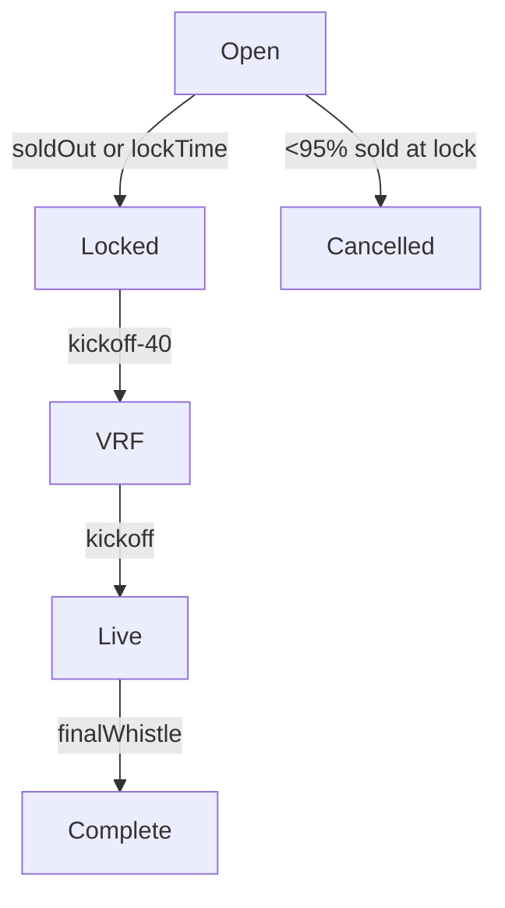

# Weekly Football Squares – Technical Specification

> **Status:** DRAFT
> **Owners:** Product – _TBD_, Engineering Lead – _TBD_, Design Lead – _TBD_
> **Last updated:** 2025‑07‑26
> **Version:** 0.4 _(supersedes v0.3 – final buffer / payout / policy sync)_

---

## 1. Executive Summary

Weekly Football Squares lets fans play **single‑game NFT squares** without season‑long commitment. Five entry tiers ($5 → $100) serve casual through high‑roller audiences, while VIP status unlocks Tier‑5 boards and bigger square caps.

**What's different from _Season Pass_:**

- **Game‑by‑game** participation only.
- **Weekly reset** every Tuesday.
- **Immediate SOL/USDC payouts** per quarter (no cumulative scoring).
- **House rake: 5% on <$100 House boards; 8% on VIP $100+ House boards; 5% on <$50 CBL boards (3% CBL, 2% House); 8% on $50+ CBL mixed boards (5% CBL, 3% House); 10% on $50+ CBL VIP-only boards (5% CBL, 3% VIP bonus, 2% House).**

---

## 2. Weekly Timeline & Game Flow

| Phase                 | Standard Time (ET)         | Key Events                                                                         | Owner           |
| --------------------- | -------------------------- | ---------------------------------------------------------------------------------- | --------------- |
| **Board creation**    | Tue 09:00                  | One board _per NFL game_ × _5 tiers_                                               | Backend cron    |
| **Open sales**        | Tue 09:05 → Kickoff‑60 min | Players purchase squares                                                           | dApp / Contract |
| **Registration lock** | Kickoff‑60 min             | Contract stops purchases; reservations expire                                      | Contract        |
| **Auto‑fill**         | Kickoff‑45 min             | If **≥ 95%** sold, House fills the last ≤ 5% squares (standard 5% rake applies)    | Backend         |
| **Cancel & refund**   | Kickoff‑45 min             | If **< 95%** sold, contract cancels board, refunds **exact paid amount** (in‑kind) | Contract        |
| **VRF digit draw**    | Kickoff‑40 min             | Chainlink VRF writes home/away digits on‑chain                                     | Contract        |
| **In‑game scoring**   | Q1 → OT                    | Oracle streams scores, emits winners                                               | Oracle          |
| **Payouts**           | Final + 5 min              | Contract pays winners, retains 5% rake                                             | Contract        |

### 2.1 Board State Machine



---

## 3. Economics & Payouts

### 3.1 Tier Table

### 3.1.1 House Board Tiers

| Tier | Entry Price | Total Pool | **House Rake** | Player Pool | VIP Only |
| ---- | ----------- | ---------: | -------------: | ----------: | :------: |
| 1    | $5          |       $500 |       5% ($25) |        $475 |    –     |
| 2    | $10         |     $1,000 |       5% ($50) |        $950 |    –     |
| 3    | $20         |     $2,000 |      5% ($100) |      $1,900 |    –     |
| 4    | $50         |     $5,000 |      5% ($250) |      $4,750 |    –     |
| 5    | $100        |    $10,000 |      8% ($800) |      $9,200 |    ✅    |
| 6    | $250        |    $25,000 |    8% ($2,000) |     $23,000 |    ✅    |
| 7    | $500        |    $50,000 |    8% ($4,000) |     $46,000 |    ✅    |

> **House board economics**: VIP bonus is 5% on all House boards. $100+ House boards are VIP-only access.

### 3.1.2 CBL Board Economics

| CBL Tier      | Entry Price | Total Pool | **Total Rake** | **CBL Share** | **House Share** | **VIP Bonus** | VIP Access |
| ------------- | ----------- | ---------: | -------------: | ------------: | --------------: | ------------: | :--------: |
| Non-Premium   | <$50        |   Variable |       5% total |            3% |              2% |            3% |   Mixed    |
| Premium Mixed | $50+        |   Variable |       8% total |            5% |              3% |            3% |   Mixed    |
| Premium VIP   | $50+        |   Variable |      10% total |            5% |              2% |            3% |  VIP-Only  |

> **CBL board economics**: VIP players earn 3% bonus on CBL boards. CBLs can choose mixed or VIP-only access for premium boards.

### 3.2 Base (Forward‑Only) Payout Split

| Quarter | % of Player Pool | Example (Tier 3) |
| ------- | ---------------- | ---------------- |
| Q1      | 15%              | $285             |
| Q2      | 25%              | $475             |
| Q3      | 15%              | $285             |
| Q4      | 45%              | $855             |

_Overtime:_ If OT occurs, Q4 payout is split 50/50 between the end‑Q4 score and the final OT score.

### 3.3 VIP Rules

- **House board access:** All tiers; VIP-only for $100+ House boards.
- **CBL board access:** All tiers; CBL chooses mixed or VIP-only.
- **Square cap:** VIP = 10; Standard = 5.
- **Win bonus:** +5% on House board winnings; +3% on CBL board winnings (separate bonus transfer).

### 3.4 House‑Board Variants & Sample $20 Board (Player Pool $1,900)

| Variant                | Quarter | Split (Forward / Alt) | $ Amounts             |
| ---------------------- | ------- | --------------------- | --------------------- |
| **Forward (standard)** | Q1      | 15%                   | **$285**              |
|                        | Q2      | 25%                   | **$475**              |
|                        | Q3      | 15%                   | **$285**              |
|                        | Q4      | 45%                   | **$855**              |
| **Forward & Backward** | Q1      | **9% / 6%**           | **$171 / $114**       |
|                        | Q2      | **15% / 10%**         | **$285 / $190**       |
|                        | Q3      | **9% / 6%**           | **$171 / $114**       |
|                        | Q4      | **27% / 18%**         | **$513 / $342**       |
| **Forward + 5**        | Q1      | **11.25% / 3.75%**    | **$213.75 / $71.25**  |
|                        | Q2      | **18.75% / 6.25%**    | **$356.25 / $118.75** |
|                        | Q3      | **11.25% / 3.75%**    | **$213.75 / $71.25**  |
|                        | Q4      | **33.75% / 11.25%**   | **$641.25 / $213.75** |

> **Definitions**
> • **Forward & Backward:** Each quarter's allocation is split 60/40 between standard alignment (Home‑Away digits) and the reversed alignment (Away‑Home).
> • **Forward + 5:** 75% of the quarter allocation rewards the exact forward digits. The remaining 25% rewards the "+5 offset" (either team's last digit plus five, modulo 10).
> • Percentages are stored per‑board and can be tuned by governance vote.

---

## 4. System Components

### 4.1 Core Service Interfaces

```typescript
// Board Management
export interface BoardService {
  /** create one board per NFL game for the given week */
  createWeeklyBoards(week: number): Promise<WeeklyBoard[]>;
  /** stop further purchases */
  closeRegistration(boardId: string): Promise<void>;
  /** fill last ≤ 5% of squares when threshold hit */
  autoFillBoard(boardId: string): Promise<void>;
  /** fire VRF request and return tx hash */
  triggerVRF(boardId: string): Promise<string>;
}

// Square Reservation & Purchase
export interface SquareService {
  reserveSquares(
    boardId: string,
    squareIndices: number[],
    userId: string,
  ): Promise<Reservation>;
  /** Confirm on‑chain payment */
  confirmPurchase(reservationId: string, txHash: string): Promise<void>;
  /** GC stale carts */
  releaseExpiredReservations(): Promise<void>;
}

// Live Scoring & Winner Calc
export interface ScoringService {
  subscribeToGame(gameId: string): void;
  processScoreUpdate(gameId: string, scores: GameScore): Promise<void>;
  /** derives winners for a given quarter */
  calculateWinners(boardId: string, quarter: string): Promise<Winner[]>;
}
```

### 4.2 Database Schema

```sql
-- Weekly boards
CREATE TABLE weekly_boards (
  board_id          VARCHAR PRIMARY KEY,
  game_id           VARCHAR NOT NULL,
  week_number       INTEGER NOT NULL,
  tier_id           VARCHAR NOT NULL,
  status            VARCHAR NOT NULL DEFAULT 'open',
  squares_sold      INTEGER DEFAULT 0,
  auto_filled       INTEGER DEFAULT 0,
  vrf_seed          VARCHAR,
  home_digits       INTEGER[],
  away_digits       INTEGER[],
  created_at        TIMESTAMP DEFAULT NOW(),
  registration_deadline TIMESTAMP NOT NULL,
  kickoff_time      TIMESTAMP NOT NULL,
  UNIQUE(game_id, tier_id)
);

-- Square ownership
CREATE TABLE weekly_squares (
  id            SERIAL PRIMARY KEY,
  board_id      VARCHAR REFERENCES weekly_boards(board_id),
  square_index  INTEGER NOT NULL,
  owner_wallet  VARCHAR,
  purchase_tx   VARCHAR,
  auto_filled   BOOLEAN DEFAULT FALSE,
  created_at    TIMESTAMP DEFAULT NOW(),
  UNIQUE(board_id, square_index)
);

-- Payout ledger
CREATE TABLE weekly_payouts (
  id            SERIAL PRIMARY KEY,
  board_id      VARCHAR REFERENCES weekly_boards(board_id),
  square_index  INTEGER NOT NULL,
  quarter       VARCHAR NOT NULL,
  amount        DECIMAL(10,2) NOT NULL,
  winner_wallet VARCHAR NOT NULL,
  payout_tx     VARCHAR,
  processed_at  TIMESTAMP DEFAULT NOW()
);
```

### 4.3 Service / Event Topology

| Layer         | Tech                 | Notes                            |
| ------------- | -------------------- | -------------------------------- |
| API Gateway   | Fastify + Zod        | Auth, rate‑limit, OpenAPI docs   |
| Worker Queue  | BullMQ               | Handles VRF polling, payout jobs |
| Message Bus   | Solana WebSockets    | Real‑time score + payout events  |
| Observability | Prom‑Grafana, Sentry | Metrics + error tracing          |

> **No changes vs v0.3** – content reproduced here in full for single‑file clarity.

---

## 5. Randomisation & Fairness

| Guarantee                | Mechanism                                                                      | Surfaced to User                |
| ------------------------ | ------------------------------------------------------------------------------ | ------------------------------- |
| Random digits            | **Chainlink VRF 40 min pre‑kickoff**                                           | "View VRF tx" link + JSON proof |
| No late buys             | Contract reverts after `lockTimestamp`                                         | Disabled purchase button        |
| Auto‑fill / Cancellation | Status banner shows either "House filled 5%" or "Board cancelled, refund sent" | Board overlay                   |

---

## 6. UX Notes

- Digit Reveal countdown now targets **40 min** before kickoff.
- If board is cancelled (< 95% sold) users see a toast + on‑chain refund reference.

---

## 7. User Experience Flows

### 7.1 New User Onboarding

1. **Wallet Connection**
   - Connect Solana wallet
   - Team selection modal for personalization

2. **Board Discovery**
   - Default to current week's games
   - Show personalized recommendations based on favorite team
   - Progressive disclosure of tier options (show 2, expand to 7)

3. **Quick Pick Flow**
   - "Recommend a board" button
   - Auto-suggests based on team preference + budget
   - One-click purchase for casual users

### 7.2 Purchase Flow

```typescript
interface PurchaseFlow {
  step1: 'board-selection'; // Choose game + tier
  step2: 'square-selection'; // Pick specific squares
  step3: 'payment-confirm'; // Review + submit transaction
  step4: 'confirmation'; // Success state + next steps
}
```

### 7.3 Live Game Experience

- **Pre-game:** Countdown to digit reveal (40 min before kickoff)
- **Digit reveal:** Animated number draw with VRF proof
- **Live scoring:** Real-time winner highlighting
- **Payouts:** Automatic distribution notification

---

## 8. Error Handling & Edge Cases

### 8.1 Registration Edge Cases

| Scenario                    | System Response                               | User Experience                     |
| --------------------------- | --------------------------------------------- | ----------------------------------- |
| Board fills during checkout | Release user's cart, show "Board Full"        | Redirect to similar tier/game       |
| VRF failure                 | Fallback to pseudo-random + manual audit flag | Display notice, proceed with backup |
| Under 95% at deadline       | Cancel board + full refunds                   | Toast notification + refund tx      |
| Network congestion          | Extend deadline by 15 minutes                 | Show updated countdown              |

### 8.2 Payment & Payout Issues

| Issue                | Detection              | Resolution                        |
| -------------------- | ---------------------- | --------------------------------- |
| Failed payment       | Transaction timeout    | Release square reservation        |
| Stuck payout         | Manual monitoring      | Retry mechanism + manual override |
| Double payment       | Duplicate tx detection | Automatic refund process          |
| Gas estimation error | Pre-flight simulation  | Dynamic fee adjustment            |

---

## 9. Config & Env Vars

```bash
# Scheduling
WEEKLY_BOARD_CREATE_CRON="0 9 * * 2"
WEEKLY_REGISTRATION_BUFFER_MINUTES=60
WEEKLY_AUTO_FILL_THRESHOLD=0.95  # upper‑bound house fill
WEEKLY_VRF_TRIGGER_MINUTES=40

# Economics
# House rake
WEEKLY_HOUSE_RAKE_PERCENTAGE=5  # <$100 House boards
WEEKLY_HOUSE_RAKE_PERCENTAGE_HIGH=8  # $100+ House boards (VIP-only)
WEEKLY_CBL_RAKE_PERCENTAGE_LOW=5  # <$50 CBL boards (3% CBL, 2% House)
WEEKLY_CBL_RAKE_PERCENTAGE_MID=8  # $50+ CBL mixed boards (5% CBL, 3% House)
WEEKLY_CBL_RAKE_PERCENTAGE_HIGH=10  # $50+ CBL VIP-only boards (5% CBL, 3% VIP bonus, 2% House)
WEEKLY_VIP_BONUS_HOUSE=5  # VIP bonus on House boards
WEEKLY_VIP_BONUS_CBL=3  # VIP bonus on CBL boards
WEEKLY_MAX_SQUARES_STANDARD=5
WEEKLY_MAX_SQUARES_VIP=10
```

---

## 10. Analytics & Monitoring

### 10.1 Key Metrics

**Business Metrics:**

- Weekly active users
- Revenue per tier per week
- Board fill rates by game/tier (target ≥95%)
- User retention (week-over-week participation)
- Board cancellation rate

**Technical Metrics:**

- API response times
- VRF success rate
- Payout distribution latency
- Database query performance

### 10.2 Event Tracking

```typescript
// Purchase funnel analytics
track('Weekly.BoardView', { boardId, tier, gameId });
track('Weekly.SquareSelect', { boardId, squareCount });
track('Weekly.PurchaseComplete', { boardId, amount, txHash });

// Game experience analytics
track('Weekly.DigitReveal', { boardId, homeDigits, awayDigits });
track('Weekly.QuarterWin', { boardId, quarter, winnerWallet, amount });
track('Weekly.PayoutComplete', { boardId, totalPayouts, processingTime });
track('Weekly.BoardCancelled', { boardId, tier, fillPercentage });
```

---

## 11. Testing Strategy

### 11.1 Integration Tests

```typescript
describe('Weekly Board Lifecycle', () => {
  it('should handle complete game cycle', async () => {
    // 1. Create board
    // 2. Simulate purchases to 96%
    // 3. Trigger auto-fill
    // 4. Execute VRF
    // 5. Process mock game scores
    // 6. Verify payouts
  });

  it('should handle under-filled board cancellation', async () => {
    // 1. Create board
    // 2. Purchase only 80% of squares
    // 3. Hit registration deadline
    // 4. Verify board cancellation
    // 5. Verify refunds processed
  });
});
```

---

## 12. Open Questions

1. Confirm VIP bonus implementation detail (bonus paid as separate transfer vs. pooled increase).
2. Minimum board creation cut‑off? (e.g., skip boards with historically low demand).
3. Mobile grid UX optimization for 7 tiers vs. current 5.

---

## 13. Document History

| Ver     | Date       | Author      | Notes                                                         |
| ------- | ---------- | ----------- | ------------------------------------------------------------- |
| 0.1     | 2025‑07‑26 | Claude Code | Initial draft                                                 |
| 0.2     | 2025‑07‑26 | ChatGPT     | Rake 5%, VIP caps, env vars                                   |
| 0.3     | 2025‑07‑26 | ChatGPT     | Auto‑fill 95%, VRF −40 m, payout variants                     |
| **0.4** | 2025‑07‑26 | ChatGPT     | Cancel <95%, fixed Forward + 5 table, removed tax/legal lines |

---

**Review Status:**

- [ ] Product Team Review
- [ ] Engineering Review
- [ ] Design Review
- [ ] Security Review
- [ ] Legal/Compliance Review

---

_This spec is the canonical reference for Weekly Football Squares. Amend via pull request; notifications are automated to all subscribing teams._
